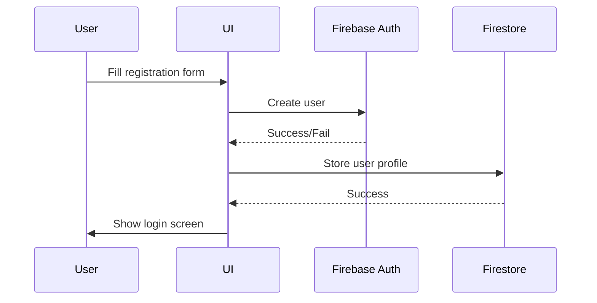
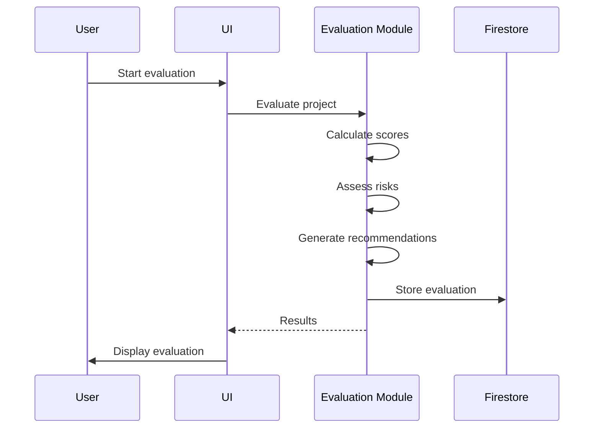
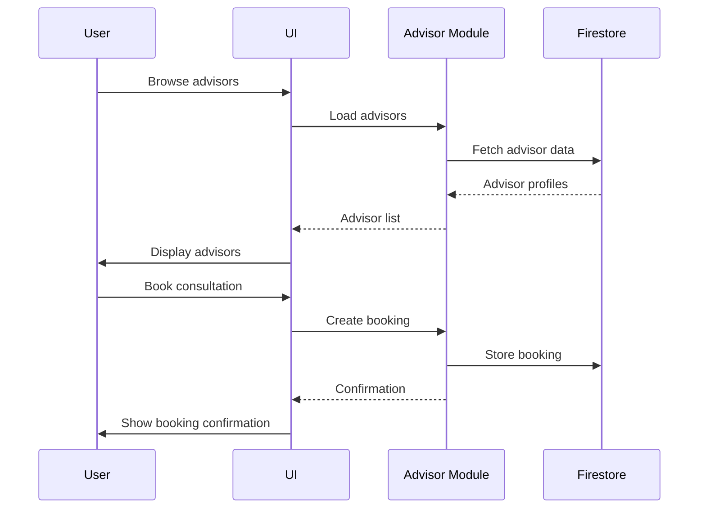
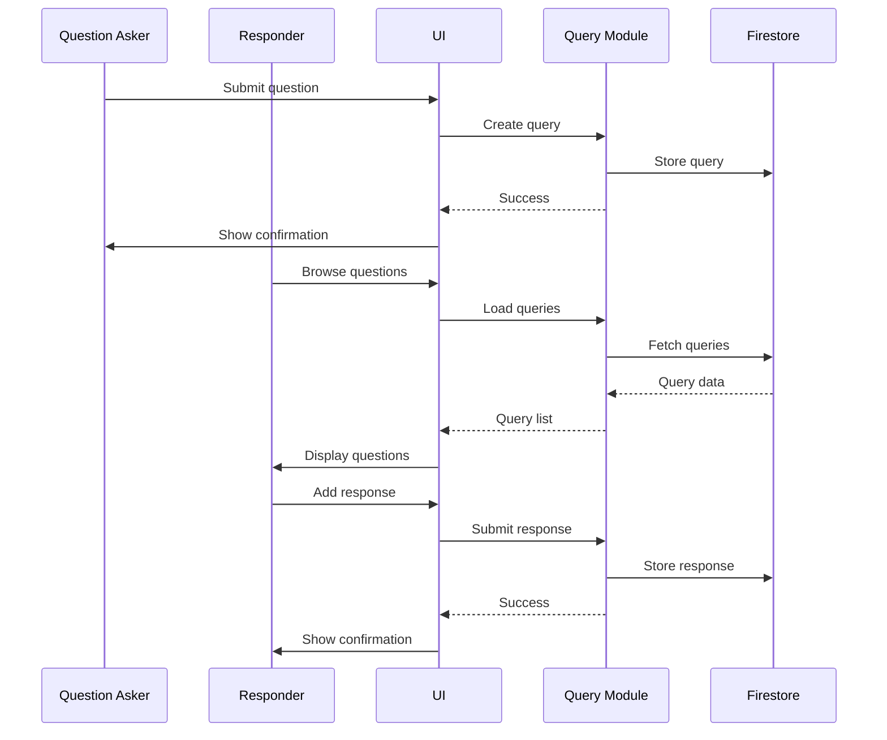

# Low-Level Design (LLD) – InvestBridge

---

## 1. Module Breakdown

### 1.1 Authentication Module (auth.js)
- Handles user registration, login, logout using Firebase Auth
- Stores additional user info in Firestore (`users` collection)
- Maintains current user state
- Supports multiple user types: entrepreneur, investor, banker, expert

### 1.2 Post Management Module (posts.js)
- Allows users to create posts (business proposals, investment criteria, loan/advisory offers)
- Fetches and displays posts from Firestore (`posts` collection)
- Filters posts based on user type and status
- Enhanced business categories with subcategories and investment ranges
- Smart category suggestions based on investment amount

### 1.3 Connection Management Module (connections.js)
- Handles sending, approving, and rejecting connection requests
- Stores connection data in Firestore (`connections` collection)
- Loads and displays user connections
- Prevents duplicate/self-connections
- Enhanced user identification and connection tracking

### 1.4 Project Evaluation Module (evaluation.js)
- Comprehensive project evaluation with scoring system
- Risk assessment with multiple risk categories
- Due diligence checklists with progress tracking
- Valuation calculations (DCF, Comparable, Asset-based)
- Investment recommendations and ROI analysis

### 1.5 Business Advisor Module (advisor.js)
- Advisor registration and profile management
- Service categories and expertise matching
- Consultation booking system
- Advisor analytics and performance tracking
- Review and rating system

### 1.6 Query & Solution Module (queries.js)
- Q&A platform with categorized questions
- Expert response system
- Knowledge base with articles
- Community features (upvoting, helpful marking)
- Search and filtering capabilities

### 1.7 Logging Module (logging.js)
- Logs all major actions (register, login, post, connect, approve, reject)
- Displays logs in a UI panel and console
- Persists logs in local storage for debugging
- Enhanced logging for new features

### 1.8 UI Module (ui.js)
- Manages dashboard tabs, forms, and content rendering
- Handles user feedback (alerts, tooltips, button states)
- Responsive design for desktop/mobile
- Modal systems for detail views
- Enhanced form styling and interactions

### 1.9 Main Application Module (main.js)
- Entry point for the application
- Orchestrates module interactions
- Handles global event listeners
- Manages application state

---

## 2. Key Data Models

### 2.1 User
```json
{
  "id": "string",           // Firebase Auth UID
  "name": "string",
  "email": "string",
  "userType": "string",    // 'entrepreneur', 'investor', 'banker', 'expert'
  "phone": "string",
  "createdAt": "ISO string",
  "expertise": ["string"], // For experts/advisors
  "experience": "number",  // Years of experience
  "certifications": ["string"]
}
```

### 2.2 Post
```json
{
  "id": "string",           // Firestore doc ID
  "userId": "string",      // UID of creator
  "userName": "string",
  "userType": "string",    // poster's type
  "title": "string",
  "description": "string",
  "amount": "number",
  "category": "string",    // Enhanced category system
  "subcategory": "string", // New subcategory field
  "investmentRange": "string", // Investment range
  "postType": "string",    // 'loan', 'advisory', 'proposal', 'investment'
  "status": "string",      // 'active', 'funded', 'evaluated', etc.
  "createdAt": "ISO string",
  "tags": ["string"]       // Enhanced tagging system
}
```

### 2.3 Connection
```json
{
  "id": "string",           // Firestore doc ID
  "investorId": "string",  // UID of investor
  "entrepreneurId": "string", // UID of entrepreneur
  "bankerId": "string",    // UID of banker (if any)
  "postId": "string",      // Linked post
  "status": "string",      // 'pending', 'approved', 'rejected'
  "createdAt": "ISO string",
  "requestedBy": "string", // UID of requester
  "updatedAt": "ISO string",
  "statusUpdatedBy": "string"
}
```

### 2.4 Project Evaluation
```json
{
  "id": "string",
  "postId": "string",      // Linked post
  "evaluatorId": "string", // UID of evaluator
  "overallScore": "number",
  "riskScore": "number",
  "dueDiligenceProgress": "number",
  "valuation": {
    "dcf": "number",
    "comparable": "number",
    "assetBased": "number",
    "recommended": "number"
  },
  "recommendations": ["string"],
  "createdAt": "ISO string"
}
```

### 2.5 Advisor Profile
```json
{
  "id": "string",
  "userId": "string",
  "name": "string",
  "title": "string",
  "company": "string",
  "expertise": ["string"],
  "experience": "number",
  "rating": "number",
  "reviewCount": "number",
  "services": [{
    "name": "string",
    "price": "number",
    "description": "string"
  }],
  "availability": "string",
  "responseTime": "string",
  "bio": "string"
}
```

### 2.6 Query
```json
{
  "id": "string",
  "authorId": "string",
  "authorName": "string",
  "title": "string",
  "description": "string",
  "category": "string",
  "tags": ["string"],
  "urgency": "string",
  "status": "string",      // 'open', 'answered', 'resolved'
  "expertRequested": "boolean",
  "anonymous": "boolean",
  "upvotes": "number",
  "views": "number",
  "responses": "number",
  "createdAt": "ISO string"
}
```

### 2.7 Knowledge Base Article
```json
{
  "id": "string",
  "title": "string",
  "content": "string",
  "category": "string",
  "authorId": "string",
  "authorName": "string",
  "difficulty": "string",  // 'beginner', 'intermediate', 'advanced'
  "readingTime": "number",
  "views": "number",
  "helpfulCount": "number",
  "tags": ["string"],
  "createdAt": "ISO string"
}
```

---

## 3. Main Functions & Responsibilities

### Authentication (auth.js)
- `register(event)`: Handles user registration, validates input, creates Firebase Auth user, stores profile in Firestore
- `login(event)`: Authenticates user, loads user data
- `logout()`: Signs out user, clears state
- `onAuthStateChanged`: Reacts to login/logout, loads all app data

### Post Management (posts.js)
- `createPost(event)`: Validates and creates a new post in Firestore
- `loadBrowseContent()`: Loads and filters posts for the current user
- `getCategorySuggestions(amount)`: Suggests categories based on investment amount
- `loadSubcategories(category)`: Dynamically loads subcategories

### Connection Management (connections.js)
- `connectWithUser(postId)`: Initiates a connection request, prevents duplicates/self-connections
- `loadConnections()`: Loads and displays user's connections
- `updateConnectionStatus(connectionId, status)`: Approves or rejects a connection
- `viewConnectionDetails(connectionId)`: Shows detailed info (for bankers)

### Project Evaluation (evaluation.js)
- `evaluateProject(postId)`: Performs comprehensive project evaluation
- `assessRisk(postId)`: Calculates risk scores across multiple categories
- `generateDueDiligenceReport(postId)`: Creates due diligence checklist and report
- `calculateValuation(postId)`: Performs multiple valuation methods
- `getRecommendations(postId)`: Generates investment recommendations

### Business Advisor (advisor.js)
- `registerAsAdvisor(event)`: Registers user as business advisor
- `loadAdvisors(category)`: Loads and filters advisors
- `bookConsultation(advisorId)`: Books consultation with advisor
- `addBooking(bookingData)`: Creates new booking
- `loadMyBookings()`: Loads user's consultation bookings

### Query & Solution (queries.js)
- `submitQuery(event)`: Creates new query
- `addResponse(queryId, responseData)`: Adds response to query
- `searchQueries(filters)`: Searches and filters queries
- `searchKnowledgeBase(filters)`: Searches knowledge base
- `markResponseAsHelpful(responseId)`: Marks response as helpful
- `acceptResponse(responseId, queryId)`: Accepts response as answer

### Logging (logging.js)
- `log(message, type, user)`: Logs actions to UI and console
- `saveLogsToLocalStorage()`, `loadLogsFromLocalStorage()`: Persist/retrieve logs

### UI (ui.js)
- `showDashboardTab(tab)`: Switches dashboard content
- `showDashboard()`: Displays dashboard after login
- `viewProfile(userId)`: Shows user profile popup
- `viewQuery(queryId)`: Shows query detail modal
- `viewArticle(articleId)`: Shows article detail modal
- `viewAdvisorProfile(advisorId)`: Shows advisor profile modal

---

## 4. Interaction Flow Between Modules
- **User registers/logs in** → Auth module creates user and loads profile → UI module shows dashboard
- **User creates post** → Post module validates and saves to Firestore → UI updates post list
- **User browses posts** → Post module fetches and filters posts → UI displays cards
- **User sends connection request** → Connection module validates and saves to Firestore → UI/logging modules update
- **User manages connections** → Connection module loads/updates status → UI/logging modules update
- **User evaluates project** → Evaluation module performs analysis → Results displayed in UI
- **User books consultation** → Advisor module creates booking → UI updates booking list
- **User asks question** → Query module creates query → UI displays in query list
- **User responds to query** → Query module adds response → UI updates query detail

---

## 5. Enhanced Features

### 5.1 Enhanced Business Categories
- **Hierarchical Categories**: Main categories with subcategories
- **Investment Ranges**: Predefined investment amount ranges
- **Smart Suggestions**: Category suggestions based on investment amount
- **Visual Indicators**: Icons and color coding for categories
- **Dynamic Loading**: Subcategories loaded based on main category selection

### 5.2 Project Evaluation Metrics
- **Scoring System**: Multi-factor evaluation with weighted scoring
- **Risk Assessment**: Comprehensive risk analysis across multiple dimensions
- **Due Diligence**: Interactive checklists with progress tracking
- **Valuation Methods**: DCF, Comparable, and Asset-based valuations
- **Recommendations**: AI-like recommendations based on evaluation results

### 5.3 Business Advisor Module
- **Advisor Registration**: Comprehensive advisor onboarding
- **Service Categories**: Multiple service types with pricing
- **Expertise Matching**: Smart matching based on requirements
- **Booking System**: Consultation booking with scheduling
- **Review System**: Rating and review functionality

### 5.4 Query & Solution System
- **Q&A Platform**: Community-driven question and answer system
- **Expert Responses**: Verified expert response system
- **Knowledge Base**: Curated articles and resources
- **Search & Filter**: Advanced search and filtering capabilities
- **Community Features**: Upvoting, helpful marking, and acceptance

### 5.5 Modular Architecture
- **Separated Concerns**: Each module handles specific functionality
- **Maintainable Code**: Easy to update and extend individual features
- **Reusable Components**: Shared functions and utilities
- **Clean Dependencies**: Clear module dependencies and interactions

---

## 6. Sequence Diagrams

### 6.1 Enhanced User Registration


### 6.2 Project Evaluation


### 6.3 Advisor Consultation Booking


### 6.4 Query & Response System


---

## End of LLD 